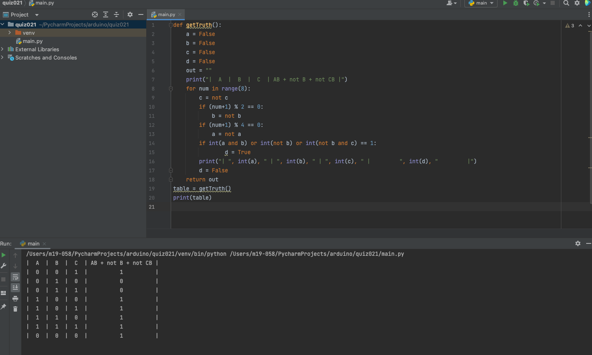
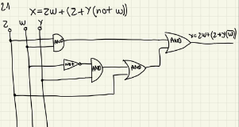
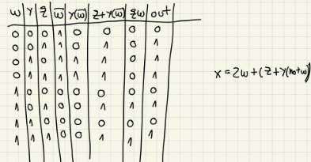

# Quiz021
## Code
```.py
def getTruth():
    a = False
    b = False
    c = False
    d = False
    out = ""
    print("|  A  |  B  |  C  | AB + not B + not CB |")
    for num in range(8):
        c = not c
        if (num+1) % 2 == 0:
            b = not b
        if (num+1) % 4 == 0:
            a = not a
        if int(a and b) or int(not b) or int(not b and c) == 1:
                d = True
        print("| ", int(a), " | ", int(b), " | ", int(c), " |         ", int(d), "         |")
        d = False
    return out
table = getTruth()
print(table)
```
## Test

## Circuit


## Table

