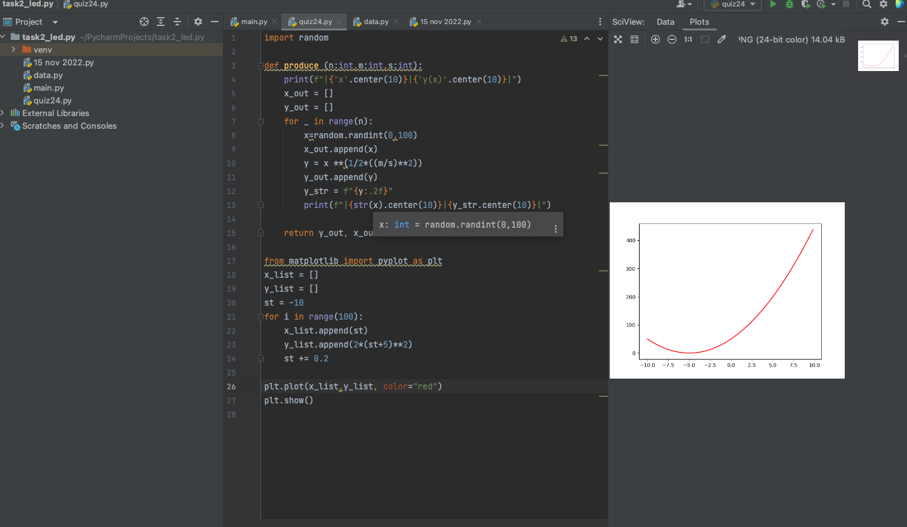
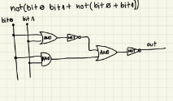

# Quiz 024
## Code
```.py

import random

def produce (n:int,m:int,s:int):
    print(f"|{'x'.center(10)}|{'y(x)'.center(10)}|")
    x_out = []
    y_out = []
    for _ in range(n):
        x=random.randint(0,100)
        x_out.append(x)
        y = x **(1/2*((m/s)**2))
        y_out.append(y)
        y_str = f"{y:.2f}"
        print(f"|{str(x).center(10)}|{y_str.center(10)}|")

    return y_out, x_out

from matplotlib import pyplot as plt
x_list = []
y_list = []
st = -10
for i in range(100):
    x_list.append(st)
    y_list.append(2*(st+5)**2)
    st += 0.2

plt.plot(x_list,y_list, color="red")
plt.show()
```

## Test

## Circuit

