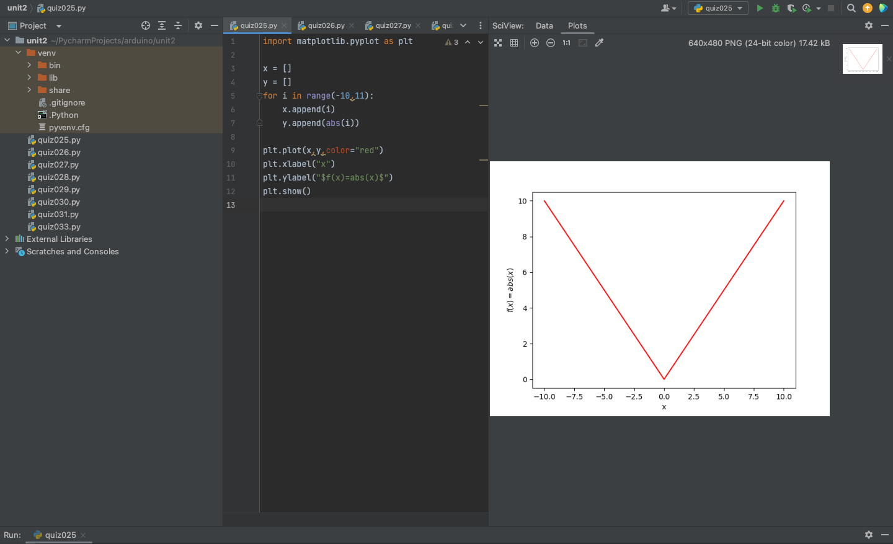

# Quiz 025
## Code
```.py
import matplotlib.pyplot as plt

x = []
y = []
for i in range(-10,11):
    x.append(i)
    y.append(abs(i))

plt.plot(x,y,color="red")
plt.xlabel("x")
plt.ylabel("$f(x)=abs(x)$")
plt.show()
```
## Test

