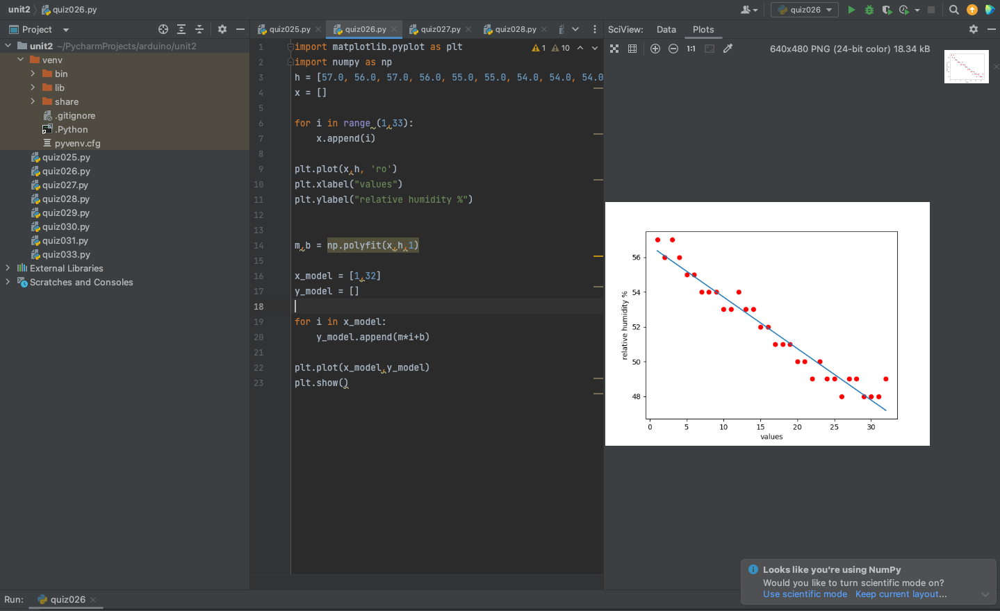
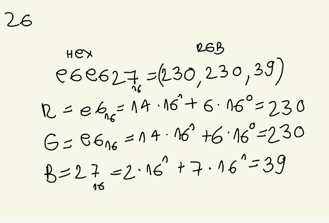

# Quiz 026
## Code
```.py
import matplotlib.pyplot as plt
import numpy as np
h = [57.0, 56.0, 57.0, 56.0, 55.0, 55.0, 54.0, 54.0, 54.0, 53.0, 53.0, 54.0, 53.0, 53.0, 52.0, 52.0, 51.0, 51.0, 51.0, 50.0, 50.0, 49.0, 50.0, 49.0, 49.0, 48.0, 49.0, 49.0, 48.0, 48.0, 48.0, 49.0]
x = []

for i in range (1,33):
    x.append(i)

plt.plot(x,h, 'ro')
plt.xlabel("values")
plt.ylabel("relative humidity %")


m,b = np.polyfit(x,h,1)

x_model = [1,32]
y_model = []

for i in x_model:
    y_model.append(m*i+b)

plt.plot(x_model,y_model)
plt.show()
```
## Test


## Convert the following color in hex to rgb #e6e627

