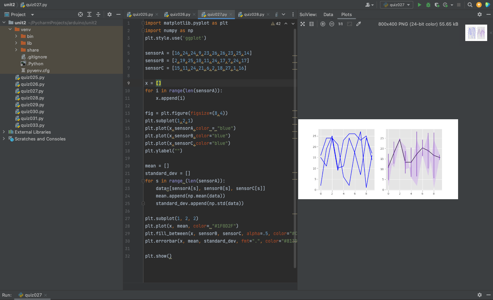

# Quiz027
## Code
```.py
import matplotlib.pyplot as plt
import numpy as np
plt.style.use('ggplot')

sensorA = [16,24,24,9,23,26,26,23,25,14]
sensorB = [2,19,25,10,11,24,17,7,24,17]
sensorC = [15,11,24,21,6,2,18,27,1,16]

x = []
for i in range(len(sensorA)):
    x.append(i)

fig = plt.figure(figsize=(8,4))
plt.subplot(1,2,1)
plt.plot(x,sensorA,color = "blue")
plt.plot(x,sensorB,color="blue")
plt.plot(x,sensorC,color="blue")
plt.ylabel("")

mean = []
standard_dev = []
for s in range (len(sensorA)):
    data=[sensorA[s], sensorB[s], sensorC[s]]
    mean.append(np.mean(data))
    standard_dev.append(np.std(data))

plt.subplot(1, 2, 2)
plt.plot(x, mean, color= "#1F0D2F")
plt.fill_between(x, sensorB, sensorC, alpha=.5, color="#CFADEC")
plt.errorbar(x, mean, standard_dev, fmt=".", color="#813DBD")

plt.show()
```
## Test

