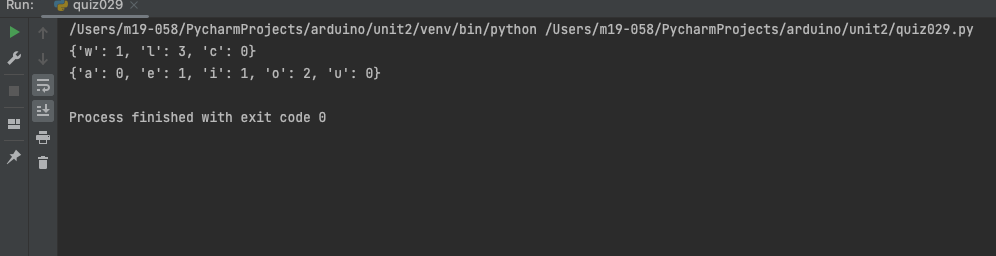

# Quiz 029
## Code
```.py
def count_letters(lexicon, msg):
    for letters in msg:
        if letters in lexicon.keys():
            lexicon[letters] += 1
    return lexicon

case1 = count_letters({'w': 0, 'l': 0, 'c': 0}, "hello world")
print(case1)
case2 = count_letters({'a': 0, 'e': 0, 'i': 0, 'o': 0, 'u': 0}, "Why did I choose CS?")
print(case2)
```

## Test


## How many different colors could you represent in a 6 bit computer? 

To calculate how many different colors can be captured or displayed, simply raise the number 2 to the power of the number of bits used to record or display the image. In this case it would be 2^6 = 64
 
In a 6 bit computer we can represent 64 colors.

Bibliography:
The Math of Color Dept, https://www.scss.tcd.ie/Cathal.OConnor/website-digital-video/4%20The%20Arithmetic%20of%20Color%20Depth.html. 
