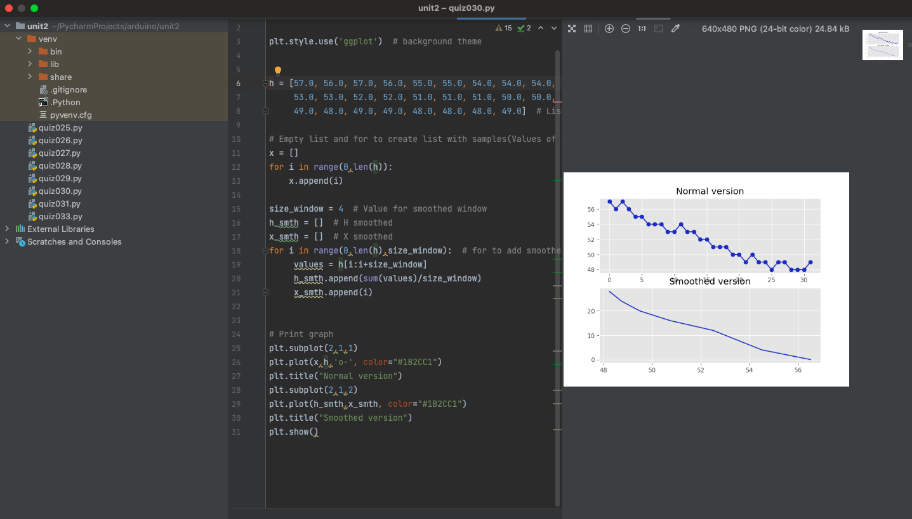

# Quiz 030

## Code
```.py


h = [57.0, 56.0, 57.0, 56.0, 55.0, 55.0, 54.0, 54.0, 54.0, 53.0, 53.0, 54.0,
     53.0, 53.0, 52.0, 52.0, 51.0, 51.0, 51.0, 50.0, 50.0, 49.0, 50.0, 49.0,
     49.0, 48.0, 49.0, 49.0, 48.0, 48.0, 48.0, 49.0]  # List for data

# Empty list and for to create list with samples(Values of X)
x = []
for i in range(0,len(h)):
    x.append(i)

size_window = 4  # Value for smoothed window
h_smth = []  # H smoothed
x_smth = []  # X smoothed
for i in range(0,len(h),size_window):  # for to add smoothed values to the list
     values = h[i:i+size_window]
     h_smth.append(sum(values)/size_window)
     x_smth.append(i)


# Print graph
plt.subplot(2,1,1)
plt.plot(x,h,'o-', color="#1B2CC1")
plt.title("Normal version")
plt.subplot(2,1,2)
plt.plot(h_smth,x_smth, color="#1B2CC1")
plt.title("Smoothed version")
plt.show()
```

## Test


## When was the internet first created?

The Internet started in the 1960s as a way for government researchers to share information. Computers in the '60s were large and immobile and in order to make use of information stored in any one computer, one had to either travel to the site of the computer or have magnetic computer tapes sent through the conventional postal system.

Another catalyst in the formation of the Internet was the heating up of the Cold War. The Soviet Union's launch of the Sputnik satellite spurred the U.S. Defense Department to consider ways information could still be disseminated even after a nuclear attack. This eventually led to the formation of the ARPANET (Advanced Research Projects Agency Network), the network that ultimately evolved into what we now know as the Internet. ARPANET was a great success but membership was limited to certain academic and research organizations who had contracts with the Defense Department. In response to this, other networks were created to provide information sharing.

January 1, 1983 is considered the official birthday of the Internet. Prior to this, the various computer networks did not have a standard way to communicate with each other. A new communications protocol was established called Transfer Control Protocol/Internetwork Protocol (TCP/IP). This allowed different kinds of computers on different networks to "talk" to each other. ARPANET and the Defense Data Network officially changed to the TCP/IP standard on January 1, 1983, hence the birth of the Internet. All networks could now be connected by a universal language.

A Brief History of the Internet, https://www.usg.edu/galileo/skills/unit07/internet07_02.phtml#:~:text=January%201%2C%201983%20is%20considered,Protocol%20(TCP%2FIP). 
