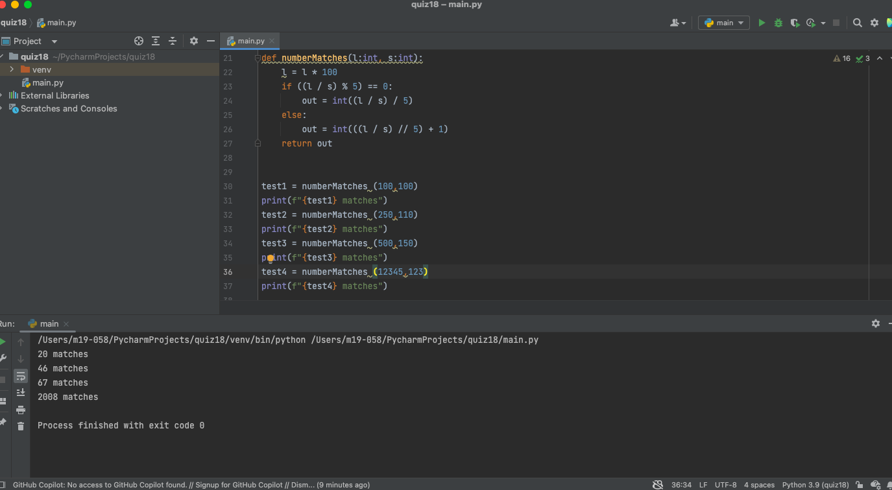

# Quiz 018
## Code
```.py

def numberMatches(l:int, s:int):
    l = l * 100
    if ((l / s) % 5) == 0:
        out = int((l / s) / 5)
    else:
        out = int(((l / s) // 5) + 1)
    return out


test1 = numberMatches (100,100)
print(f"{test1} matches")
test2 = numberMatches (250,110)
print(f"{test2} matches")
test3 = numberMatches (500,150)
print(f"{test3} matches")
test4 = numberMatches (12345,123)
print(f"{test4} matches")
```
## Test

