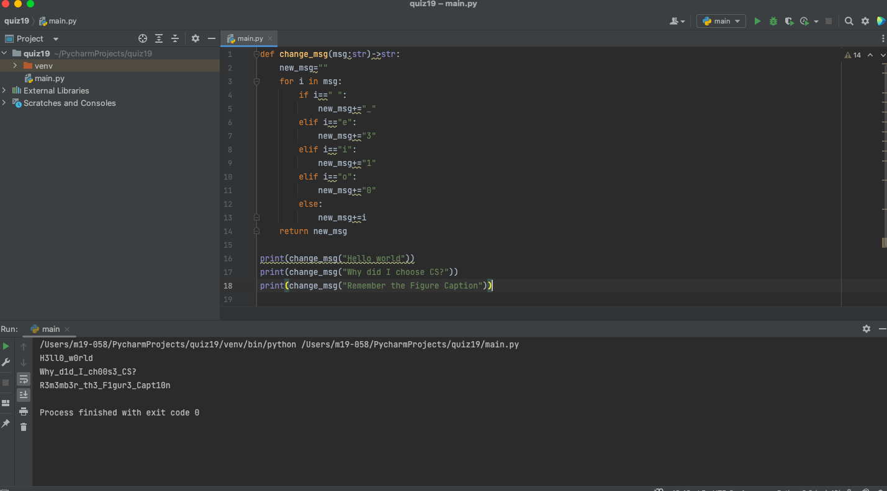

# Quiz019
## Code
```.py
def change_msg(msg:str)->str:
    new_msg=""
    for i in msg:
        if i==" ":
            new_msg+="_"
        elif i=="e":
            new_msg+="3"
        elif i=="i":
            new_msg+="1"
        elif i=="o":
            new_msg+="0"
        else:
            new_msg+=i
    return new_msg

print(change_msg("Hello world"))
print(change_msg("Why did I choose CS?"))
print(change_msg("Remember the Figure Caption"))
```
## Test

