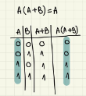

# Quiz 022
## Code
```.py
import random
random.seed (1234)
def produce (n:int,m:int,s:int)->float:
    print(f"|{'x'.center(10)}|{'y(x)'.center(10)}|")
    for num in range(n):
        x = random.randint(0,100)
        y = x ** (1/2 * (m/s) ** 2)
        x = str(x)
        y = str(round(y,2))
        print(f"|{x.center(10)}|{y.center(10)}|")

sample = produce (5,3,2)
print(produce)
```
## Test

## Truth table (proof)

